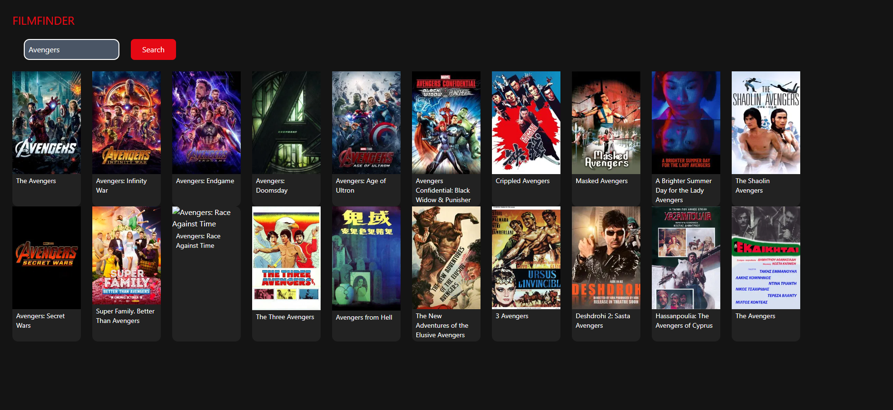
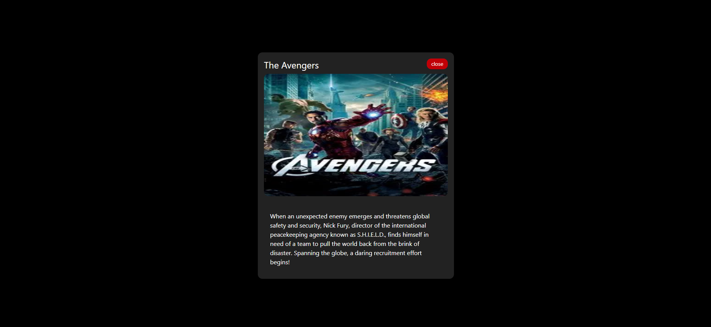

# 🎬 FilmFinder

A Netflix-inspired movie search app built with React and the TMDB API.


## 🔗 Live Demo
[bibekkunwar.github.io/movie-search-app](https://bibekkunwar.github.io/movie-search-app/)

---

## ✨ Features
- Search any movie by title using the TMDB API
- Results displayed in two horizontal scrollable rows (10 movies each)
- Click any movie card to open a detailed modal with poster and overview
- Scrollable modal with close button for long descriptions
- Four-layer error handling — empty input, failed request, no results found
- Enter key support for faster searching
- Netflix-themed dark UI built with Tailwind CSS

---

## 🛠 Tech Stack
- React 19
- Vite
- Tailwind CSS
- TMDB API

---

## 🚀 Getting Started

### 1. Clone the repo
```bash
git clone https://github.com/bibekkunwar/movie-search-app.git
cd movie-search-app
```

### 2. Install dependencies
```bash
npm install
```

### 3. Set up environment variables
Create a `.env` file in the root of the project:

put the api key inside this file.

Get your free API key at [themoviedb.org](https://www.themoviedb.org/settings/api)

### 4. Run locally
```bash
npm run dev
```

---

## ⚙️ Configuration

### vite.config.js
The `base` property is set to match the GitHub Pages repo name:
```js
base: '/movie-search-app/'
```
If you fork this repo, update this to match your own repo name.

### package.json
Deployment scripts using `gh-pages`:
```json
"predeploy": "npm run build",
"deploy": "gh-pages -d dist"
```

### .env
Never commit your `.env` file. Make sure `.env` is listed in your `.gitignore`.

---

## 📸 Screenshots




---

## 👤 Author
Bibek Kunwar — [github.com/bibekkunwar](https://github.com/bibekkunwar)
